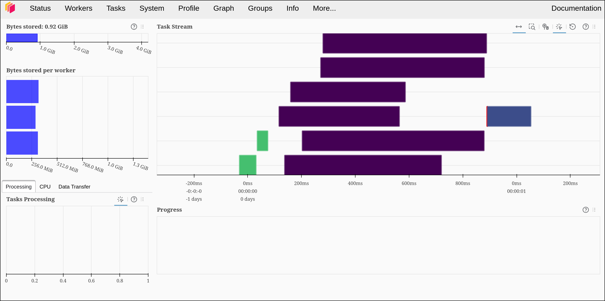

# Computación distribuida con Dask, Docker y Prefect

Laboratorio de Arquitectura de Software Avanzada para procesar **300.000 transacciones sucias** sin cargar el lote completo en un solo proceso. Implementa el patrón **Master–Worker**: un scheduler Dask coordina el grafo, tres workers procesan chunks independientes y Prefect conserva los estados, reintentos, logs y métricas del flujo.

El generador crea seis CSV de 50.000 filas. El flow crea una tarea distribuida por CSV: cada tarea lee, limpia y escribe solamente su partición, y los workers pueden ejecutar hasta dos tareas concurrentes porque tienen dos hilos. El resultado se materializa en seis Parquet comprimidos con Snappy.

## Qué resuelve

- Estandariza `raw_customer_code` a `CUST-XXXXX` con regex; datos no recuperables se conservan como `CUST-00000-ANOMALY`.
- Repara mojibake UTF-8/Latin-1, por ejemplo `Bogotá` → `Bogotá`.
- Normaliza teléfonos colombianos heterogéneos a diez dígitos (`3101234567`); centinelas y teléfonos inválidos quedan como nulos.
- Procesa particiones en paralelo con Dask y escribe Parquet por partición.
- Publica en Prefect una matriz de carga por worker y un detalle por partición.

## Arquitectura y recursos

| Servicio | Rol | Recursos | Puertos publicados |
|---|---|---:|---|
| `dask-scheduler` | Master: coordina DAG y workers | 1 CPU, 1 GB RAM | `8786`, `8787` |
| `dask-worker-1` | Worker | 2 hilos, 1.5 GB RAM | Interno |
| `dask-worker-2` | Worker | 2 hilos, 1.5 GB RAM | Interno |
| `dask-worker-3` | Worker | 2 hilos, 1.5 GB RAM | Interno |
| `prefect-server` | UI, historial, logs y artifacts | — | `4200` |
| `pipeline` | Runner temporal del flow, tests y verificador | — | Interno |

Todos los servicios comparten la red bridge `dask-cluster-net` y el directorio local `shared-data/`, montado como `/shared-data` dentro de los contenedores. Los workers tienen `mem_limit: 1500m` y `--memory-limit 1500MB`, evitando que Dask suponga más memoria que la disponible en el cgroup.

## Estructura del proyecto

```text
.
├── docker-compose.yml          # Scheduler, 3 workers, Prefect Server y runner
├── Dockerfile                  # Imagen Python 3.11 compartida por los servicios
├── requirements.txt
├── evidencian-.png             # Evidencia del dashboard Dask tras una ejecución
├── src/
│   ├── cleaning.py             # Funciones puras de limpieza
│   ├── generate_dirty_data.py  # Generador reproducible de seis CSV
│   ├── pipeline_flow.py        # Flow Prefect y tareas Dask
│   ├── observability.py        # Tablas por worker y partición
│   └── verify.py               # Verificación independiente de Parquet
├── tests/test_cleaning.py      # 40 pruebas unitarias
└── shared-data/                # Datos generados; no se versionan en Git
    ├── raw/
    └── processed/
```

Los archivos raíz `generate_dirty_data.py` y `pipeline.py` son puntos de entrada de compatibilidad; los comandos documentados usan los módulos en `src/`.

## Requisitos previos

- Docker Engine y Docker Compose v2.
- Al menos 6 GB de RAM asignados a Docker (el clúster reserva aproximadamente 5.5 GB).
- Puertos locales `4200`, `8786` y `8787` libres.

Comprueba Docker antes de empezar:

```bash
docker --version
docker compose version
```

## Ejecución completa

Ejecuta estos pasos desde la raíz del repositorio y en este orden.

### 1. Construir y levantar la infraestructura

```bash
docker compose up -d --build
docker compose ps
```

Debe haber cinco servicios en estado `Up`: el scheduler, los tres workers y `prefect-server`. El servicio `pipeline` no se queda ejecutándose: se invoca bajo demanda con `docker compose run`.

Confirma que el scheduler registró los tres workers:

```bash
docker compose logs dask-scheduler --tail 40
```

Busca tres líneas `Register worker` con los nombres `worker-1`, `worker-2` y `worker-3`.

### 2. Ejecutar las pruebas unitarias

```bash
docker compose run --rm --no-deps pipeline pytest tests/ -q
```

Resultado esperado: `40 passed`. Estas pruebas validan códigos canónicos y anómalos, mojibake reversible, texto sano, todos los formatos de teléfono y el esquema final de una partición.

### 3. Generar los datos crudos

```bash
docker compose run --rm --no-deps pipeline python -m src.generate_dirty_data
```

Resultado esperado: seis archivos `transactions_dirty_part_1.csv` a `transactions_dirty_part_6.csv` en `shared-data/raw/`, con 50.000 filas cada uno. La semilla fija `42` hace reproducible el experimento.

Cada registro contiene estas columnas:

| Columna | Contenido |
|---|---|
| `transaction_id` | Identificador `TX-0000001` a `TX-0300000` |
| `raw_customer_code` | Variantes de prefijo, espacios, ruido, vacío o nulo |
| `city_notes_corrupted` | Texto sano corrompido como UTF-8 interpretado en Latin-1, vacío o nulo |
| `phone_raw` | Formatos `+57`, `0057`, puntos, extensión, centinelas y vacío |
| `amount_usd` | Valor exponencial con 3 % de nulos |
| `business_category` | Una de cinco categorías de negocio |

### 4. Ejecutar el flow distribuido

```bash
docker compose run --rm pipeline
```

El flow `dask-prefect-distributed-cleaning` ejecuta nueve tareas:

```text
1. Validar infraestructura Dask
2. Verificar CSV crudos particionados
   ├── 3. Limpiar partición en worker Dask (parte 1)
   ├── 3. Limpiar partición en worker Dask (parte 2)
   ├── 3. Limpiar partición en worker Dask (parte 3)
   ├── 3. Limpiar partición en worker Dask (parte 4)
   ├── 3. Limpiar partición en worker Dask (parte 5)
   └── 3. Limpiar partición en worker Dask (parte 6)
4. Publicar observabilidad y quality gates
```

Las seis tareas centrales se envían mediante `DaskTaskRunner` al clúster existente. Cada una carga solo su CSV con Pandas, ejecuta las transformaciones en su worker y escribe su Parquet; por tanto, la carga total no se concentra en un único nodo.

El flow falla si no hay tres workers, no hay exactamente seis CSV, una partición está vacía, el resultado no tiene 300.000 filas, queda algún código nulo o persiste mojibake.

### 5. Verificar el resultado independientemente

```bash
docker compose run --rm --no-deps pipeline python -m src.verify
```

El verificador lee los seis Parquet con Pandas/PyArrow —sin reutilizar el flow— y exige:

- 300.000 filas en total.
- Seis archivos Parquet de salida.
- Cada código es canónico o `CUST-00000-ANOMALY`.
- No hay códigos nulos.
- No hay secuencias `Ã` o `Â` en `city_notes`.

En la última ejecución validada se obtuvieron 281.879 códigos canónicos, 18.121 anomalías, 279.115 teléfonos válidos y cero restos de mojibake.

### 6. Consultar la observabilidad

- Dask Dashboard: <http://localhost:8787/status>. Abre **Task Stream** para ver la actividad de las tareas en los workers e **Workers** para CPU y memoria de cada nodo.

#### Evidencia de ejecución distribuida

La siguiente captura corresponde al Dask Dashboard después de ejecutar el flow. Las
barras del **Task Stream** prueban que las tareas se materializaron en paralelo; el
panel izquierdo muestra la memoria repartida entre los tres workers. Las duraciones y
el worker concreto pueden variar entre ejecuciones porque el scheduler balancea las
particiones según disponibilidad.



El flow habilita el registro de **Task Stream** antes de enviar las seis particiones,
por lo que las barras quedan disponibles al abrir el dashboard después de que termine.
Dask conserva una ventana limitada de tareas recientes y la vacía al reiniciar el
scheduler; los artifacts de Prefect sí permanecen en su volumen.

La etapa final del flow deja dos artifacts persistentes en Prefect:

| Artifact | Contenido |
|---|---|
| `dask-cluster-execution-breakdown` | Particiones, filas, hilos y tiempo de procesamiento agregado por worker |
| `dask-partitions-by-worker` | Worker, hilo, filas, anomalías, mojibake reparado y duración de cada CSV |

También se pueden listar desde la terminal:

```bash
docker compose run --rm --no-deps pipeline prefect artifact ls
```

### 7. Detener el clúster

```bash
docker compose down
```

Esto elimina contenedores y red, pero conserva `shared-data/` y el volumen `prefect-data`. Para borrar también el historial persistente de Prefect, usa `docker compose down -v`.

## Tolerancia a fallos y recomputación

El lote oficial suele terminar en pocos segundos, por lo que es difícil detener un worker a tiempo. Para observar el comportamiento de fallo, usa un lote mayor. Inicia el segundo comando y, mientras el flow sigue ejecutándose, corre el tercero desde otra terminal:

```bash
docker compose run --rm --no-deps -e NUM_ROWS=3000000 pipeline python -m src.generate_dirty_data
docker compose run --rm -e NUM_ROWS=3000000 pipeline
docker compose stop dask-worker-2
```

Dask detecta la pérdida del worker, invalida sus resultados transitorios y reconstruye las ramas necesarias desde los CSV compartidos. La tarea Prefect tiene reintentos, así que el trabajo puede volver a programarse sobre los workers disponibles. Inspecciona los eventos con:

```bash
docker compose logs dask-scheduler --tail 100
```

Al terminar la demostración, vuelve a habilitar el worker y restaura el tamaño oficial:

```bash
docker compose start dask-worker-2
docker compose run --rm --no-deps pipeline python -m src.generate_dirty_data
docker compose run --rm pipeline
```

## Respuestas de análisis arquitectónico

### 1. Cuello de botella: red frente a CPU

Las expresiones regulares, la decodificación de texto y la serialización de Parquet consumen CPU. La distribución es ventajosa cuando cada chunk tiene suficiente trabajo para amortizar coordinar tareas, serializar argumentos y transferir resultados. Con pocos datos o particiones muy pequeñas, esos costes de red y coordinación pueden superar el ahorro de CPU, de modo que Pandas mononodo resulta más rápido. El punto de cambio depende del tamaño de la partición, latencia y ancho de banda; se mide comparando tiempos y el Task Stream de Dask.

### 2. Tolerancia a fallos y recomputación

Si se detiene `dask-worker-2`, el scheduler detecta que el worker desapareció y marca como perdidas las tareas o resultados que solo estaban allí. Como conserva el DAG y los CSV de origen siguen disponibles en el volumen compartido, puede reasignar las ramas afectadas a los workers 1 y 3 y recomputarlas. No inventa resultados ni continúa desde datos intermedios perdidos: reconstruye solo las dependencias necesarias. Prefect complementa esto reintentando las tareas declaradas con `retries`.

### 3. Por qué Parquet y no un CSV concatenado

Parquet conserva tipos y almacena datos por columna, con compresión Snappy en este proyecto. Consultar una o pocas columnas evita parsear el resto, y los motores compatibles pueden aplicar *predicate pushdown* para descartar grupos de filas antes de leerlos. CSV obliga a leer y volver a interpretar texto completo en cada consulta, ocupa más espacio y no preserva tipos de forma nativa.

### 4. Separación de responsabilidades: Prefect frente a Dask

Dask resuelve el cómputo: mantiene el grafo de ejecución, asigna tareas a workers, administra recursos y permite recomputación. Prefect gobierna el proceso: dependencias de negocio, estados `Scheduled`/`Running`/`Completed`/`Failed`, reintentos, logs, historial y artifacts. Usar ambos evita convertir un motor de cómputo en un orquestador de procesos y deja evidencia auditable de cada ejecución.

## Notas para desarrollo

- El código de `src/` está montado en los contenedores. Si cambias una función que ya importó un worker, reinicia scheduler y workers antes de volver a ejecutar el flow:

  ```bash
  docker compose restart dask-scheduler dask-worker-1 dask-worker-2 dask-worker-3
  ```

- `shared-data/` está en `.gitignore`: es salida reproducible de laboratorio y no debe subirse al repositorio.
- Tras cambiar dependencias o el `Dockerfile`, reconstruye con `docker compose up -d --build`.
